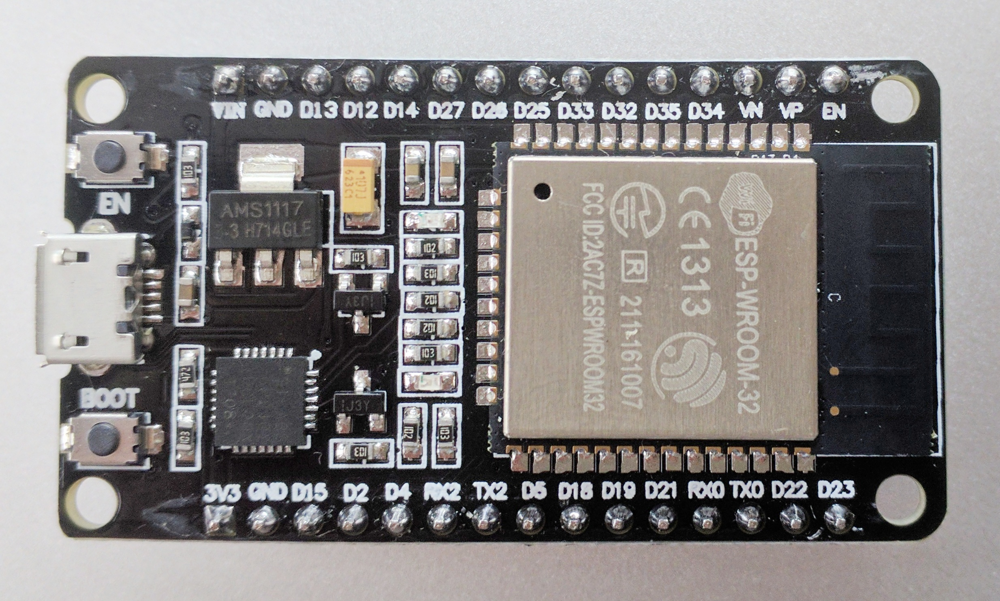

# Hydra32
Hydra32 | A Wi-Fi Penetration firmware for ESP32

# 🐍 Hydra32 — ESP32 Wi-Fi Penetration Tool


> ⚠️ **FOR EDUCATIONAL AND AUTHORIZED TESTING PURPOSES ONLY** ⚠️  
> Unauthorized use of this tool **may violate laws** in your country.  
> You alone are responsible for any misuse.


## 📜 Legal & Ethical Disclaimer
```
This software is intended ONLY for: 
• Penetration testing on networks you own.
• Educational research in controlled environments.
• Hardware/software experimentation on your own devices.

Any other use may violate: 
• Computer Fraud and Abuse Act (CFAA) — USA
• UK Computer Misuse Act
• EU Cybercrime Convention
• Local telecommunications laws
• Other national/regional legislation

ALWAYS obtain explicit written consent before testing any network or device you do not own.
```

The author(s) assume NO responsibility for: 
```
• Misuse of this software
• Damage to devices/networks
• Legal consequences
• Any negative outcomes

By using this software, you accept full liability for your actions.
```


## 🔒 Why Source Code Is Partially Hidden

The **core packet injection logic** — responsible for crafting and sending deauthentication/beacon frames — is **NOT included** in this repository.
```
**Reasons:**
- Prevent misuse by unskilled individuals.
- Comply with security research ethics.
- Avoid distributing ready-to-use harmful code.
- Encourage learning through protocol study.
```
Only **non-harmful UI code and framework logic** are provided.  
If you need the **full version** for **legitimate, legal research** — you must **implement your own packet logic**.


## 📜 Features

- **Wi-Fi Deauthentication Attacks**
  - Broadcast deauth frames
  - Rogue AP impersonation
  - Deauth until shutdown or timeout *(toggle on/off)*

- **Wi-Fi Beacon Spam**
  - Timeout toggle *(on/off)*
  - Limit number of fake APs

- **Clean Web UI**
  - Select target AP(s)
  - Choose attack type & duration *(optional)*


## 🖥 Supported Hardware

- **ESP32 Devkit V1** *(recommended)*
- Any ESP32 board with sufficient flash & Wi-Fi capability

---

## 📸 Device Photo



## Screenshots 


## ⚙️ Installation

### 1️⃣ Requirements
- ESP32 Flash Download Tool
- USB cable for flashing
- ESP32 board *(Devkit V1 recommended)*

### 2️⃣ Download Firmware
Go to Releases and download:
- `bootloader.bin`
- `partitions-table.bin`
- `hydra32.bin`
  
### 3️⃣ Flashing Instructions

**Using ESP32 Flash Download Tool:**
bootloader.bin → Offset: 0x1000
partitions-table.bin → Offset: 0x8000
hydra32.bin → Offset: 0x10000


**Example command (esptool.py):**
```bash
esptool.py -p /dev/ttyS5 -b 115200 --after hard_reset write_flash \
  --flash_mode dio --flash_freq 40m --flash_size detect \
  0x8000  partitions-table.bin \
  0x1000  bootloader.bin \
  0x10000 hydra32.bin
```

# Credits & Inspiration


Inspired by: SpacehuhnTech/esp8266_deauther

Some ideas and codes from
https://github.com/risinek/esp32-wifi-penetration-tool

Jeija/esp32free80211 


# Thanks to the 
ESP32 Open-Source Community for contributions.


# 📌 Final Notes
Hydra32 is a learning and research tool.
Misusing it harms the security community and may lead to stricter laws against hardware freedom.
Be responsible.
